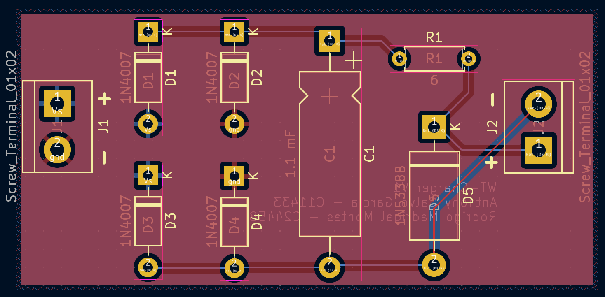
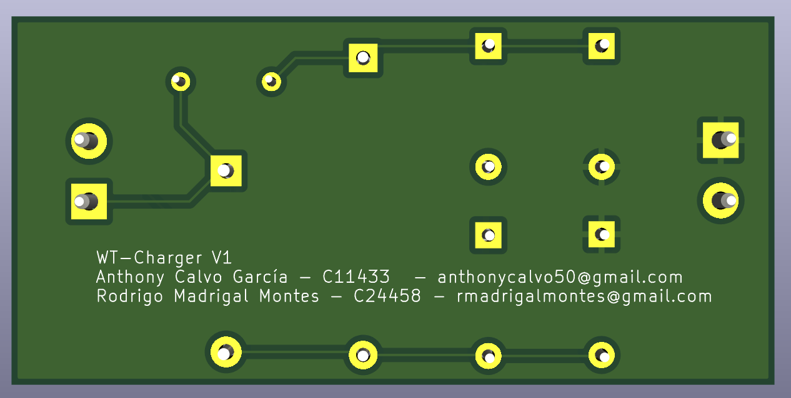
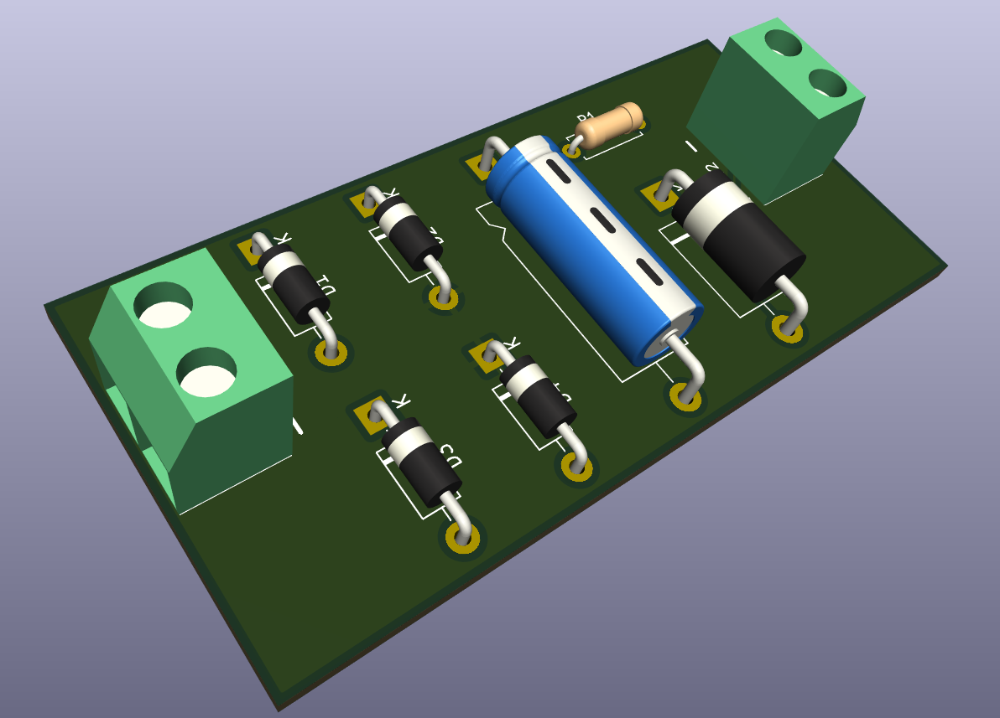

# WalkieTalkie-ChargerPCB-IE0313

Repositorio para la tarea del curso IE0313 sobre el diseño de una PCB de una fuente de alimentación para un Walkie-Talkie. Contiene el circuito esquemático, el diseño de la PCB en KiCad y documentación sobre los componentes a utilizar, el procedimiento de diseño y otros detalles. 

Este repositorio y sus contenidos fueron diseñados durante el curso IE0313 durante el periodo II-2024 por los siguientes integrantes del equipo:

|        **Integrantes**      | **Carné** |
|:---------------------------:|:---------:|
|    Anthony Calvo García     |   C11433  |
|   Rodrigo Madrigal Montes   |   C24458  |

## Agradecimientos a PCBWay

Queremos expresar nuestros agradecimientos a **PCBWay** por su increíble apoyo en la fabricación de las PCBs para esta tarea. Desde el primer contacto hasta la recepción de las placas, la experiencia fue excelente. Las PCBs que recibimos superaron nuestras expectativas en términos de precisión y acabado. Cada detalle fue manejado con cuidado, asegurando un rendimiento óptimo y mostrando una calidad sobresaliente.

La comunicación fue clara y fluida, y el tiempo de entrega se cumplió en el plazo esperado. Recibimos las placas en perfectas condiciones, en un empaque seguro y listas para ensamblar. Además siempre estuvieron disponibles para responder preguntas y asegurarse de que todo saliera según lo planeado, lo cual nos brindó seguridad y apoyo durante todo el proceso de pedido.

### Resultado del ensamblaje

Soldar y ensamblar estas placas fue una experiencia cómoda y bastante agradable, ya que todas las medidas de las huellas que se escogieron para los componentes en la fase de diseño corresponden perfectamente en el producto terminado y los resultados finales son un testimonio del compromiso de **PCBWay** con la excelencia. Aquí se muestran fotografías de la PCB ensamblada y terminada:

|  |
|:--:|
| *Vista frontal de la PCB sin ensamblar* |

|  |
|:--:|
| *Vista trasera de la PCB sin ensamblar* |

Como se ve las placas se corresponden con lo esperado, y una vez se soldaron los componentes el resultado es el siguiente:

|  |
|:--:|
| *Vista frontal de la PCB ensamblada* |

|  |
|:--:|
| *Vista isométrica de la PCB ensamblada* |

|  |
|:--:|
|  |

Recomendamos sus servicios para cualquiera que busque fabricar PCBs con precisión y profesionalismo, visitando su sitio web en [pcbway.com](https://www.pcbway.com).

## Organización y contenido de los directorios 

Este repositorio contiene dos directorios principales, cuyos contenidos son:

- `kicad_project`: Contiene los archivos de diseño y configuarción del proyecto
    - `CargadorWalkieTalkie.kicad_pcb`
    - `CargadorWalkieTalkie.kicad_pro`
    - `CargadorWalkieTalkie.kicad_sch`

- `outputs`: Contiene todos los archivos de salida de *KiCad*

Si se desea utilizar este diseño y manufacturarlo por medio de un fabricante se debe comprimir los archivos incluidos en la carpeta `outputs` en un archivo `.zip` y este se puede cargar en la página del fabricante para ordenar la fabricación de la PCB. 

## Circuito base

El circuito del que partimos para diseñar la PCB es el que se diseñó en la **Tarea 3**:

|  |
|:--:|
| *Circuto de la fuente de alimentación* |

Para este ciruito se tiene el siguiente listado de componentes:

|     Componente     | Especificación |
|:------------------:|:--------------:|
|    Transformador   |      20:1      |
| Diodo rectificador |     1N4007     |
|      Capacitor     |     1.1 mF     |
|     Resistencia    |      6 Ω       |
|     Diodo Zener    |     1N5338B    |
|      Fusible 1     |     400 mA     |
|      Fusible 2     |     200 mA     |

## Diseño del esquemático 

Primero para el diseño del esquemático de la PCB se seleccionó la opción *Schematic Editor* en *KiCad*, posteriormente se siguió la metodología de pasos descrita en la página de [Arcos-Lab Wiki](https://wiki.arcoslab.org/en/tutorials/kicad/example), a lo cual primero se definieron el el título, fecha y revisión del proyecto. 

Posteriormente se procedió a agregar los símbolos de cada componente a utilizar en el esquemático, acomodarlos y realizar las conexiones, a lo cual se obtuvo lo siguiente:

|  |
|:--:|
| *Diseño del esquemático* |

Aquí hay algunas elecciones que es importante mencionar son:

### Transformador

Se realizó una investigación sobre diseños de circuitos en el mismo programa que eran similares a este y se encontró que en base a las recomendaciones y experiencias de estos usuarios determinamos que era mejor dejar el transformador fuera de la PCB ya que consumen mucho más espacio y es más seguro conectarlo como un componente externo, por lo cual para este diseño consideramos que la salida del transformador se conecta en la terminal `J1`. 

### Elección de huellas y componentes

Por otro lado en cuanto a las huellas de los componentes por ejemplo para los diodos, tanto para los `1n4007` y el `1n5338B` se utilizo la huella que ya venía asignada por defecto en el programa; y aplicamos lo mismo para la resistencia y las terminales. Ahora bien en cuanto al capacitor se realizó la busqueda de varios capacitores disponibles en el mercado para poder determinar las dimensiones a utilizar del mismo. 

Nos terminamos decantando por los modelos de capacitor del fabricante **Vishay** de una capacitancia de 1200 μF que es lo más cercano al valor teórico que definimos en el circuito. Y se utilizaron las medidas presentes en el [Datasheet 135D, 135J, 135L](https://www.vishay.com/docs/40024/135d-135j-135l.pdf) y se asignaron a la huella en el esquemático. Y además se agregó el *Datasheet* del mismo en la tabla de componentes en el programa para poder acceder rápidamente al mismo sin necesidad de salir del programa y buscarlo. 

Después se procedió a colocar las etiquetas a los nodos `Vs` y `gnd` para los nodos de alimentación y tierra, y se colocaron los símbolos de `PWR_FLAG` para indicar a *KiCad* que es por medio de estos nodos que se alimentará el circuito. 

Y una vez realizados todos los pasos anteriores se procedió a seleccionar la opción *Perform electrical rules check* para verificar que no haya conexiones inválidas o algún error en alguna configuración del circuito a lo cual obtuvimos una salida sin errores. 

## Diseño de la PCB

Primero se realizó la configuración previa en el editor de PCB, donde definimos que la placa tendría dos capas y se definieron el el título, fecha y revisión del proyecto en esta página. Posteriormente se utilizó la opción *Update PCB with schematic changes* para poder importar los modelos del esquemático a la página del editor de PCB.

Luego de esto se procedió a acomodar los componente en el editor tomando en cuenta la configuarción que menos espacio requiera y sea fácil de reconocer cada componente. Se realizaron las conexiones de los componentes, entre las capas **F. Cu** y **B. Cu** y se asignó que en la capa **F. Cu** se conectaría el nodo `gnd` y la capa **B. Cu** va ligada a `Vs`. Por último se procedió a hacer el relleno de cada capa dentro del recuadro definido de la PCB que definimos y se corrieron las pruebas dentro del programa para asegurar que no haya errores, a lo cual se obtuvieron los siguientes resultados:

|  |
|:--:|
| *Vista de la PCB con ambas capas superpuestas* |

Y viendo las conexiones de cada capa por separado se tiene los siguiente:

|  |
|:--:|
| *Capa **F. Cu** de la PCB* |

|  |
|:--:|
| *Capa **B. Cu** de la PCB* |

### Consideraciones adicionales

Por cuestiones de tiempo por el momento para este diseño no se tomó en cuenta la configuración del tamaño de las pistas de conexión en la PCB, pero esto queda pendiente como una futura mejora para el adecuado funcionamiento y como protección del circuito. Además tampoco tomamos en cuenta los fusibles en la placa por el mismo motivo y queda igualmente pendiente como mejora al diseño. 

Antes de terminar el diseño agregamos los nombre de los integrantes y de la placa (`WT-Charger V1`) en la parte trasera de la PCB haciendo uso de la capa **B. Silkscreen**, que como observación importante notamos que todo lo que se agregue en esta capa ya sea texto o un logo desde el editor debe verse en espejo ya que el editor mira la placa desde el frente de la misma. Agregando este cambio se consiguió lo siguente:

|  |
|:--:|
| *Nombre de la placa y los integrantes en la parte trasera de la PCB* |

## Resultados finales

Como muestra de los resultados finales de este diseño se utilzó el visor 3D de *KiCad* para poder visualizar mejor la PCB, a lo cual se muestran los resultados finales en las siguientes imágenes:

|  |
|:--:|
| *Vista frontal de la PCB* |

|  |
|:--:|
| *Vista trasera de la PCB* |

|  |
|:--:|
| *Vista isométrica de la PCB* |

